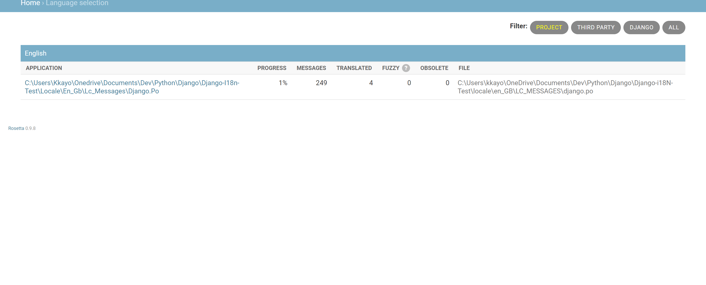

# Django-i18N-Test

Adding Internationalization to my Project

I can't seem to get it working visually when I boot up the server. It's only showing English as the option.

When it comes to generation of translation files automatically I Couldn't accomplish that, I need to do more reading around that. If you could help explain it that would be great.
